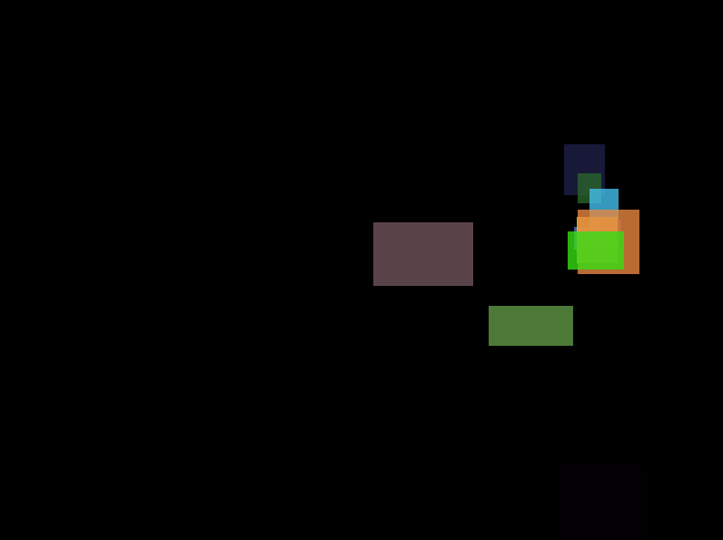

# Tween Lockscreen

A Love2D project using Lua



## Cloning
```sh
git clone https://github.com/blotta/tween-lockscreen
cd tween-lockscreen
git submodule update --init --recursive
```

## Updating
```sh
git submodule update --recursive
```

## Dependencies
* [Love2D](https://love2d.org/wiki/Main_Page)

## Running
```
love .
```
